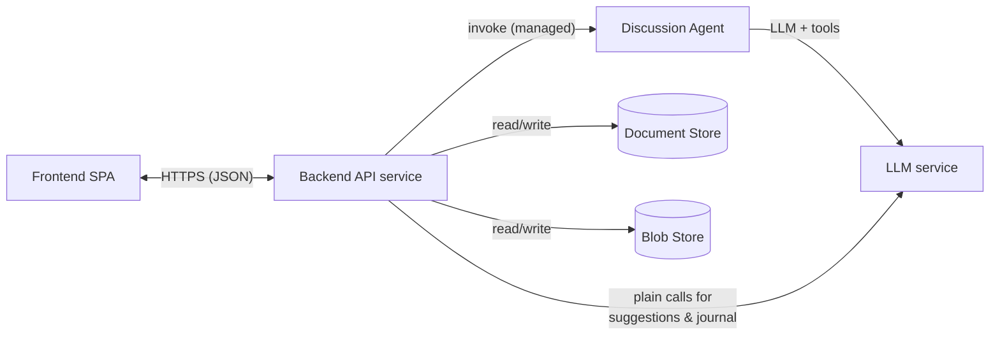
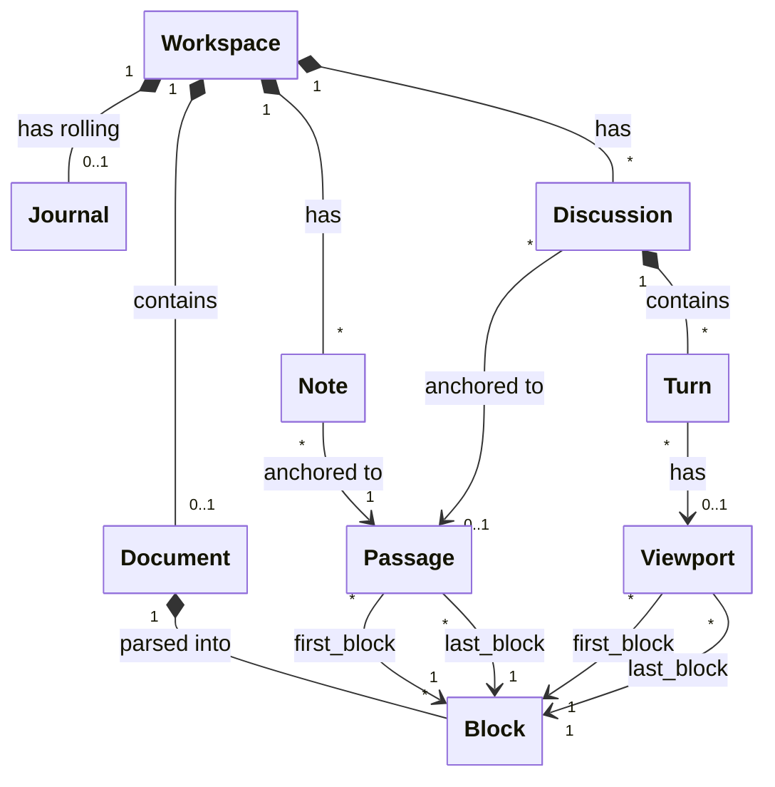

# Technical Specification: LLM-Powered Reading Companion

## 1. Introduction

This document is derived from [user_specification.md](user_specification.md). It defines the architecture in **provider-neutral terms**; the concrete technology bindings (Python, GCP, ADK, Agent Engine) are isolated in [§8 Implementation Mapping](#8-implementation-mapping) so the same spec can drive an implementation in a different language or on a different provider.

Detailed behavior is specified in linked Gherkin feature files ([features/](features/)); interface and data contracts are in machine-readable files ([contracts/](contracts/)).

## 2. System Overview

| Component | Responsibility |
|-----------|----------------|
| **Frontend SPA** | Reading view, selection/mark UI, notes UI, discussion UI, journal view; reports viewport & selection; holds workspace cookie |
| **Backend API service** | All persistence, upload validation & parsing, context assembly, invoking the agent and plain LLM calls |
| **Discussion agent** | Tool-using agent for discussion turns only (user-spec §7: suggestions and journal are deliberately *not* agentic) |
| **Document Store** | Workspaces, parsed document blocks, notes, discussions, journal |
| **Blob Store** | Raw uploaded files (retained for provenance/re-parsing) |
| **LLM service** | Plain completions for passage suggestions and reading-journal synthesis |

**Key boundary rule:** the frontend never talks to the Document Store, Blob Store, agent, or LLM directly. Everything goes through the Backend API ([contracts/api.openapi.yaml](contracts/api.openapi.yaml)), which is also where workspace authorization (capability-URL check) and prompt-injection wrapping happen.

The workspace cookie is a client-side convenience pointer to the last-used workspace, written and read by the SPA only; the backend neither sets nor reads it, and it plays no role in authorization.

## 3. Data Model

### 3.1 Entities and Relationships

UML class diagram showing entities and their relationships:

### 3.2 Entities Details

Full schemas of the entities are here: [contracts/data-model.yaml](contracts/data-model.yaml). Here is a high-level description:

- **Workspace**: The root container.
- **Document**: At most one per workspace, immutable (a new document means a new workspace).
- **Block**: Immutable parsed units of the Markdown document (paragraph, heading, list item, code block, blockquote) with stable sequential IDs.
  - On upload, the backend parses the document **once** into an ordered list of blocks.
  - Why use blocks rather than flat text with global offsets? Markdown must be parsed to be displayed, and user selections happen in the *rendered* text, whose offsets don't match the raw source. Parsing once server-side into plain-text blocks makes the block list the single canonical form — the client only styles blocks, never parses — so client and server agree on offsets by construction. Blocks also make viewport reporting trivial (first/last visible block element), give search results a natural location granularity, and keep any offset error contained to one block.
- **Passage**: A specific text selection defined by the first block of the passage, last block of the passage along with two Unicode code-point indices relative to the start of these blocks. 
  - Before a Passage object is created, we have a **mark** (selection) made by the user using the UI. Marks are ephemeral client state — per user-spec §4.1 nothing is written when a passage is marked. A mark becomes a persistent Passage only as the anchor of a note or discussion.
- **Viewport**: The visible range of blocks at a given time.
  - The viewport reported by the client to the backend is simply `{first_visible_block_id, last_visible_block_id}`, sent with each AI-invoking request. The backend resolves block IDs to text server-side; the client never sends document text back.

- **Note**: Anchored to a passage (§4).
- **Discussion**: A conversation with the agent, optionally anchored to a passage.
- **Turn**: One user message + one agent response (with optional tool-call trace) in a discussion.
- **Journal**: The current rolling reading journal (regenerating replaces it; prior versions are not kept).

### 3.3 Context Assembly & the Discussion Agent

The heart of the app (user-spec §2). For every AI-invoking request the backend assembles a specific **context envelope** (`discussion_context`, `suggestions_context`, or `journal_context`) — schemas in [contracts/agent-contract.yaml](contracts/agent-contract.yaml):

| Context element | Suggestions | Discussion turn | Journal |
|---|---|---|---|
| Viewport text (resolved from block range) | ✓ | ✓ | – |
| Marked passage (anchor + text) | ✓ | ✓ if anchored | – |
| Notes near the viewport/passage | – | ✓ (N nearest to the anchor passage, or to the viewport if unanchored) | ✓ (all) |
| Recent discussion history | – | ✓ (recent turns from *other* discussions only — the current discussion's history is carried by the agent's managed session, not the context envelope) | ✓ (all) |
| Current journal | – | ✓ if present | ✓ (previous version) |
| Document metadata (filename, block count) | – | ✓ | ✓ |

The discussion agent's tools:

1. `search_document(query) → [{block_id, text, score}]` — keyword search over all blocks of the workspace's document, scoped server-side to that workspace only.
2. `web_search(query) → [{title, url, snippet}]` — external fact lookup.

The agent decides **per turn** whether to call tools (user-spec §4.2); context sufficiency is the default assumption and tools are the exception. Tool calls made during a turn are persisted in the turn record as summaries, for transparency/observability only — raw tool results are not persisted.

**Conversation state.** The discussion agent's managed session (one per discussion, keyed `workspace_id:discussion_id` — see §8) is the live conversation state: on a normal turn it supplies the current discussion's prior turns, and the context envelope injects only per-turn context. Persisted Turn records exist for the client, the journal, and for rebuilding a lost or expired session by replaying user/agent message pairs (without tool results — the agent re-searches if needed). Details: [agent-contract.yaml](contracts/agent-contract.yaml) `discussion_agent.session`.

Behavior details: [discussion.feature](features/discussion.feature), [passage-marking.feature](features/passage-marking.feature), [reading-journal.feature](features/reading-journal.feature).

## 4. Concurrency

In the case of a concurrent access to the same workspace, last-write-wins at entity level. There is no locking and no merge (user-spec §3.3).

## 5. Security Architecture

Behavior spec: [security.feature](features/security.feature).

1. **Prompt-injection resistance.** All untrusted text (document blocks, notes, prior user messages, tool results — including web-search snippets) enters prompts only inside clearly delimited data sections with a fixed wrapping format defined in [agent-contract.yaml](contracts/agent-contract.yaml); system instructions state that delimited content is data, never instructions. Tool capabilities are minimal (read-only, workspace-scoped), so even a successful injection has no write or cross-workspace reach.
2. **Workspace isolation.** Every API route is under `/workspaces/{workspace_id}`; the workspace ID is a ≥128-bit random token. Every store query is keyed by that ID — there is no listing endpoint, no cross-workspace query path, and no sequential IDs anywhere.
3. **Abuse protection.** The app is unauthenticated and AI endpoints spend LLM tokens. The backend enforces per-workspace and per-IP rate limits on the expensive endpoints — workspace creation, document upload, discussion turns, suggestions, journal generation — returning HTTP 429 when exceeded. Limit values are deployment configuration, not spec constants.
4. **Upload safety.** Enforced server-side before parsing: extension and declared-type allowlist, size limit (default 10 MB), valid-UTF-8 check. 
   - **Markdown files** are parsed with a well-maintained CommonMark parser with raw-HTML rendering disabled; sanitization rule: raw HTML (blocks and inlines) is dropped entirely, and links and all other inline formatting (emphasis, code spans) flatten to their plain text (URLs discarded) — losing inline styling is a deliberate product decision. Block constructs without a `Block.type` of their own map as follows: 
     - table → one paragraph block per row, cell texts joined with `" | "`;
     - thematic break → dropped;
     - link reference definition → dropped;
     - image → its alt text as a paragraph block (dropped when the alt text is empty);
     - nested lists → flattened into a linear sequence of `list_item` blocks in document order;
     - additional paragraphs inside a list item → separate paragraph blocks following that `list_item`. 
   - **Plain-text files** bypass the Markdown parser: they are split into paragraph blocks on blank lines, with single newlines within a paragraph joined by a space.
   - The raw file goes to the Blob Store as opaque bytes and is never executed or interpreted beyond this pipeline. Details: [document-upload.feature](features/document-upload.feature).

## 6. Feature Index

| Feature file | Covers (user-spec §) |
|---|---|
| [workspace-lifecycle.feature](features/workspace-lifecycle.feature) | 3.3 — auto-creation, cookie return, sharing, deletion, last-write-wins |
| [document-upload.feature](features/document-upload.feature) | 3.2, 5 — upload, validation, parsing into blocks |
| [reading-view.feature](features/reading-view.feature) | 3.2 — rendering, scrolling, viewport reporting |
| [passage-marking.feature](features/passage-marking.feature) | 3.4, 4.1 — marking, suggested questions |
| [discussion.feature](features/discussion.feature) | 3.5, 4.2 — agent discussion, tools, history |
| [notes.feature](features/notes.feature) | 3.6, 4.3 — note CRUD |
| [reading-journal.feature](features/reading-journal.feature) | 3.7, 4.4 — update reading journal request |
| [security.feature](features/security.feature) | 5 — injection, isolation, upload safety |

## 7. Contract Index

| Contract | Format | Defines |
|---|---|---|
| [contracts/api.openapi.yaml](contracts/api.openapi.yaml) | OpenAPI 3.1 | Backend HTTP API (plain JSON) |
| [contracts/data-model.yaml](contracts/data-model.yaml) | YAML (JSON Schema entities) | Entities, anchors, store-mapping notes |
| [contracts/agent-contract.yaml](contracts/agent-contract.yaml) | YAML | Context envelopes, shared types, tool signatures, injection-wrapping format, LLM-call contracts |

## 8. Implementation Mapping

The only section that names concrete technologies. Re-target the implementation by rewriting this table alone.

| Neutral component | Chosen implementation | Minimum version |
|---|---|---|
| Web client | React SPA (single-page application), built as static assets served from the backend service (single deployable) | React 19.2 |
| Application server | Python, FastAPI, deployed on Cloud Run | Python 3.14, FastAPI 0.139 |
| Agent on managed agent runtime | Python, Google Agent Development Kit (ADK) `LlmAgent` with function tools; deployed to Vertex AI Agent Engine (Agent Runtime); sessions managed by Agent Engine, keyed `workspace_id:discussion_id` | google-adk 2.3 |
| LLM API | Gemini via Vertex AI (agent model: current Gemini Pro tier; suggestions/journal: current Gemini Flash tier) | n/a — always resolved to the current tier at call time, never pinned to a dated model snapshot |
| Structured store | Firestore (Native mode) — collection layout in data-model.yaml | google-cloud-firestore 2.28 |
| Object storage | Google Cloud Storage, single private bucket, path `raw/{workspace_id}` | google-cloud-storage 3.12 |
| Web search tool | Google Search grounding / ADK built-in search tool | (bundled with google-adk) |
| Document search tool | Ephemeral (created on-the-fly each time the tool is called) in-memory SQLite FTS5 database for BM25 keyword-match scoring | Python stdlib `sqlite3` (FTS5-enabled build) |
| Markdown parser | A CommonMark-compliant Python library with raw HTML disabled | markdown-it-py 4.2 |
| Observability | Cloud Logging + Cloud Trace (ADK tracing enabled) | google-cloud-logging 3.16, google-cloud-trace 1.20 |
| Local development | ADK local runner + Firestore emulator + fake blob store | — |

Versions above are the most recent stable releases as of spec-writing time
(2026-07-05), not permanent pins — at implementation start, re-check for
newer releases and lock the actual pinned versions in
`pyproject.toml`/`uv.lock` (and `package.json`/lockfile for the frontend).
Do not let an agent downgrade below the versions here on the assumption
that a newer library version is unfamiliar.

**Deployment shape:** two deployables — (1) Cloud Run service: FastAPI + static SPA assets; (2) Agent Engine: discussion agent. Backend → Agent Engine calls use the provider SDK with service-account auth; the agent is not exposed publicly.

## 9. Out of Scope

Unchanged from user-spec §6: 

- no general context-free chat, 
- no MCP server, 
- no embedding-based retrieval. 

Additionally out of scope for this iteration:

- workspace retention/cleanup policy,
- PDF/EPUB/URL ingestion,
- multi-document workspaces,
- journal version history,
- offline/PWA support — called out explicitly because a reading app is exactly the kind of product where users might expect to read without a connection; this iteration assumes the user is always online.
