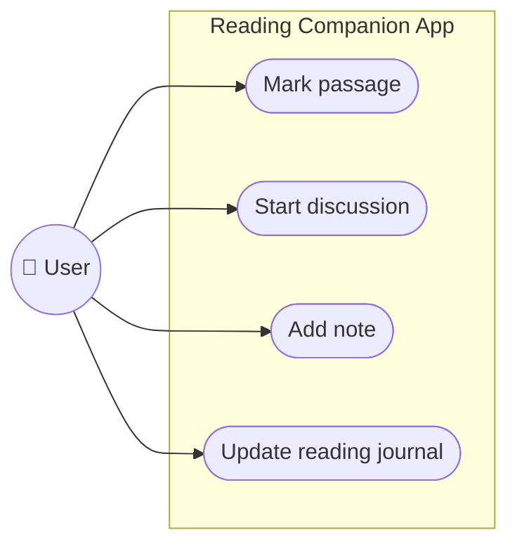

# User Specification: LLM-Powered Reading Companion

## 1. Purpose and Motivation

This document specifies the intended behavior of a reading companion web application, built as a capstone project for the "5-Day AI Agents Intensive Vibe Coding Course with Google" (Kaggle, June 2026). It is intended as input to a subsequent technical specification.

The application lets a user upload a document (article, book, etc.) and read it while an AI assistant is aware of the same context the user is currently engaging with. The goal is to make it easy to go deeper into a passage of text without breaking the reading flow, while keeping the user in the driver's seat of their own thinking rather than outsourcing it to the AI.

**Inspirations:**
- Andrej Karpathy's ["How I use LLMs"](https://www.youtube.com/watch?v=EWvNQjAaOHw) video from 2025-02-27, where he describes wanting an LLM companion for reading books but finds existing workflows clunky.
- Jeremy Howard's [Solveit](https://solve.it.com/) philosophy: AI should empower the user's thinking, not replace it, and the user and the AI should work from a shared view of the material.

## 2. Core Principle: Shared Context

The defining idea of the app is that the user and the AI see the same thing. Concretely, the AI has access to:

1. The portion of the text currently visible in the user's viewport
2. The passage the user has marked/selected, if any
3. Notes the user has written in the margin
4. The history of the discussion the user has had with the AI about the text

This shared context is what makes it easy for the user to engage in a discussion, ask short, underspecified questions ("what does this mean?"), or converse about a passage and get relevant answers without having to re-explain what they're looking at.

## 3. User-Facing Features

### 3.1 Overview

Use-case diagram of main interactions related to the uploaded document:

### 3.2 Document upload and reading

- User uploads a document (article or book-length text; format support to be scoped in technical spec).
- User reads the document in-app, scrolling/paging through it.

### 3.3 Workspace

We're going to call the uploaded document along with the related history of discussions, margin notes, reading journal etc. a workspace.

- When a new user opens the app, they are automatically assigned a new, empty workspace so they are ready to start right away.
- When a returning user opens the app, they are identified via a cookie and shown the last workspace they worked on. The cookie stores only the latest workspace ID. They can create a new workspace if they want to, which updates the cookie to the new workspace ID. To access older workspaces, the user must use their previous URLs that they might have written down somewhere outside of the app.
- There is no log in mechanism to reduce the entry barrier for the user, so they are ready immediately. Cross-device access relies entirely on the user manually copying the workspace URL.
- Workspaces and uploaded documents persist indefinitely on the server. We will retain as many as we reasonably can, without a strict retention or cleanup policy for now. They can also be manually deleted by the user.
- Each workspace has a unique URL associated with it that can be shared with others. Whoever opens up the URL has full access to the workspace, just like the user that created the workspace. Concurrent edits by multiple users will follow a simple last-write-wins model.

### 3.4 Passage marking
- User can select/mark a fragment of the text they want to explore further.
- Upon marking a passage, the app presents a small set of suggested questions or discussion starters about that passage, so the user is saved the effort of typing if one of the suggestions fits what they want to dive deeper into.

### 3.5 Discussion
- User can start a discussion or ask a question about a marked passage, either by selecting a suggested question/prompt or typing their own message.
- The AI responds and discusses using the shared context (viewport, marked passage, notes, prior discussion/Q&A) plus any additional information it determines it needs.
- The discussion history is added to the workspace's history, which remains available as context for future dialogue and questions.

### 3.6 Notes
- User can write and save their own notes attached to a passage in the document.
- Notes are private to the workspace (i.e., not public to the internet at large, but anyone with the workspace URL can view and edit them).

### 3.7 Reading journal
- On request, the app produces a rolling summary, i.e. "reading journal", synthesizing the user's notes and discussion history so far, to help them see the throughline of their own engagement with the text rather than just a transcript.

## 4. Behavior by Use Case

### 4.1 Passage marked
- App gathers current context (viewport + marked passage) and generates a short list of suggested questions or discussion starters.
- No information is written back to the workspace as a result of this action. A marked passage is only persisted if the user anchors a note or discussion to it.

### 4.2 Discussion started
- App gathers context (the currently visible viewport on the user's screen, marked passage, relevant notes/history) and passes it to the discussion/answering process along with the user's prompt or question.
- **Viewport vs. Anchor:** A discussion can be anchored to a specific passage, but the context also includes the current viewport. This allows the user to start a discussion about a marked passage, and then scroll away to read other parts of the document while continuing the same conversation.
- The system determines, per turn, whether it needs information beyond what's already in context — e.g., searching elsewhere in the document, or looking up an external fact — and only fetches it if actually needed for that specific turn.
- The response is shown to the user, and the discussion turn (prompt and response) is saved to the workspace's history.

### 4.3 Note added
- Note is saved directly to the user's workspace data, tied to a passage in the document.
- No AI processing occurs at the point the note is saved.

### 4.4 Reading journal update requested
- App gathers the user's notes and discussion history for the document.
- A summary is generated and saved as the workspace's current reading journal, which the user can view and which becomes part of the context available for future discussion.

## 5. Security Requirements

- **Prompt injection resistance:** Uploaded document content must be treated as untrusted data, never as instructions to the AI. Any text within a document that attempts to redirect the AI's behavior must not be able to do so.
- **Workspace/user isolation:** Notes, discussion history, marked passages, and uploaded documents belonging to one user must never be accessible to another user unless they were shared through a URL.
- **Upload safety:** Uploaded files must be validated and parsed safely (file type, size limits, sandboxed extraction) to prevent malformed or malicious files from compromising the server.

## 6. Out of Scope (for this iteration)

- A general, context-free chat interface that would require intent classification between note/discussion/reading journal - the current design assumes the UI itself disambiguates user intent via distinct actions (mark passage/start discussion, add note, request reading journal) and that the discussion is anchored on the document/passage.
- An MCP server exposing workspace state to external clients (e.g., Claude Desktop) - noted as a plausible, low-cost future addition, not a current requirement.
- Embedding-based retrieval over large note/discussion history corpora - the current design assumes recent history is a sufficient to find relevant information; revisit if usage patterns show this is insufficient.

## 7. Mapping to Capstone Requirements

This design is intended to demonstrate:

- **Agent / multi-agent system (ADK):** The discussion/answering component is implemented as a genuine tool-using agent; suggestion and reading journal-related synthesis are deliberately plain LLM calls.
- **Security features:** Prompt injection defense, workspace isolation, and safe upload handling.
- **Deployability:** To be demonstrated via video of the deployed, running application.
- **Antigravity:** To be demonstrated via video of the build process using Antigravity as the development environment.

MCP server and generic agent skills are treated as credible extensions rather than required elements of the current design.
